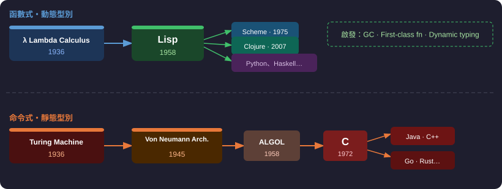
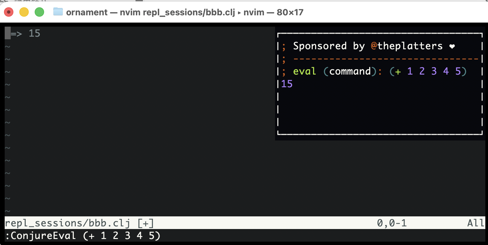
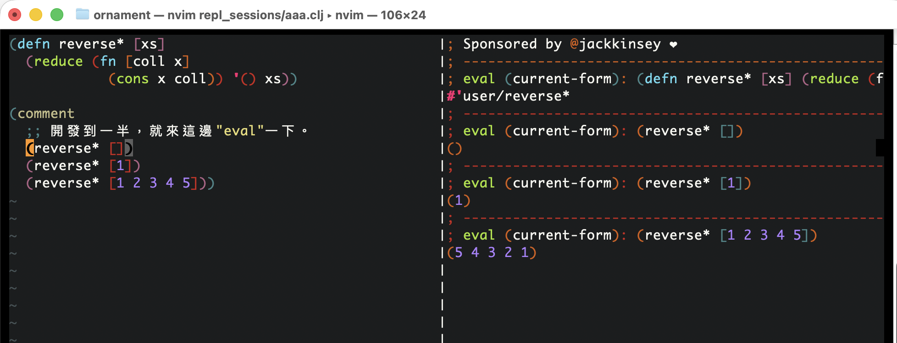
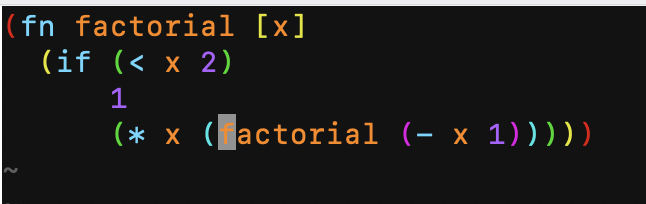
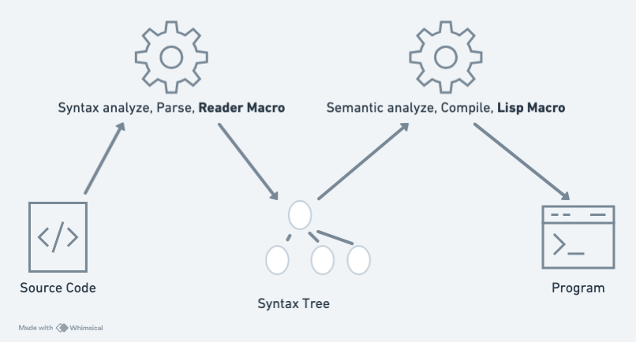
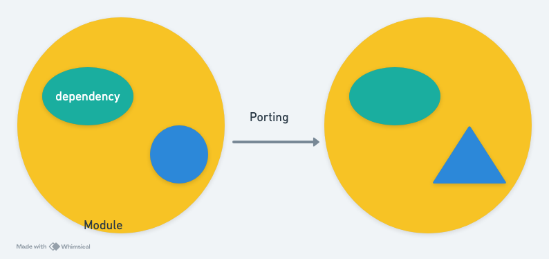
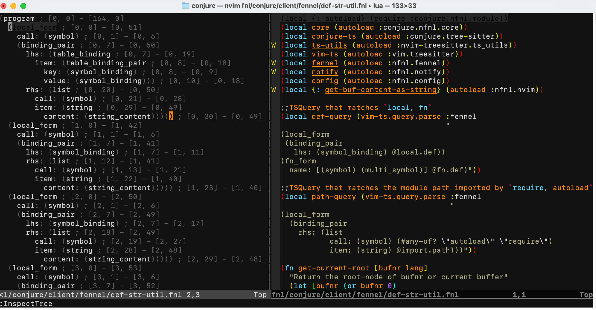
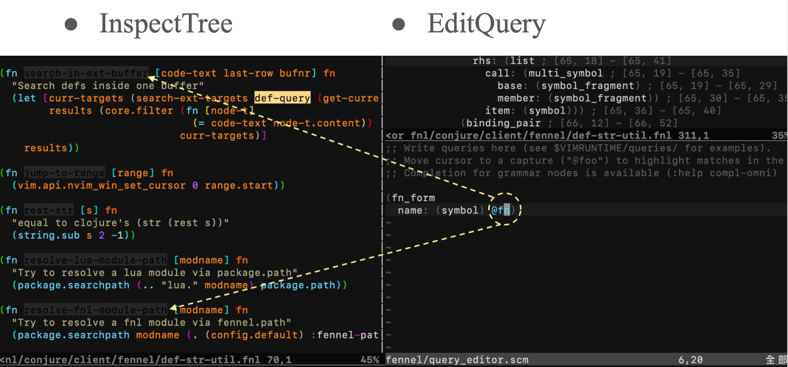
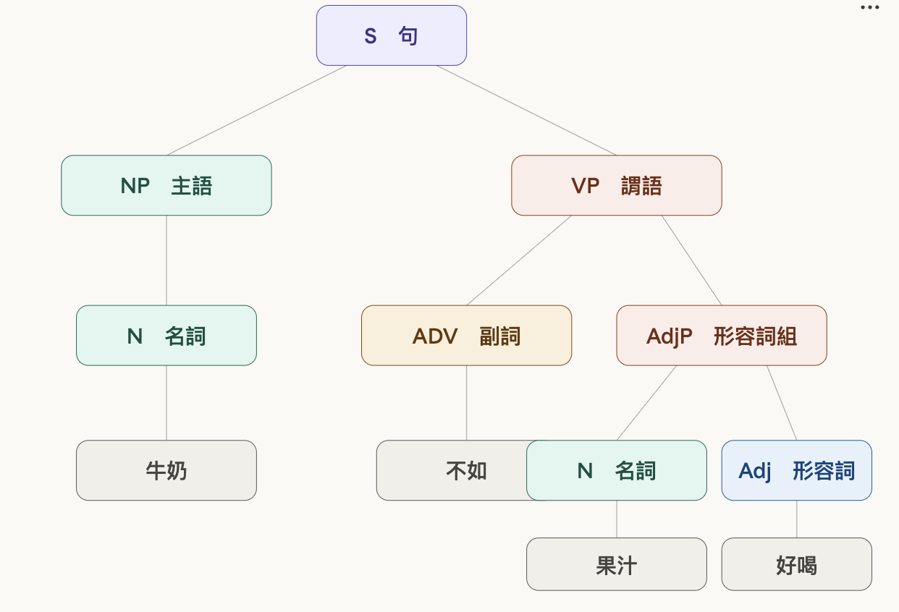

# 程式語言的源頭與未來——Lisp 的前世今生

---

## Laurence Chen / 陳家宏

- 台大電機系 (學士、碩士)
- Clojure, dbt-Taipei 線下活動主辦人
- IT 顧問、講者、作家
- 從試算表到資料平台－重構資料工程的技術與團隊


---

## Outline

- 什麼是 Lisp ?
- Lisp 的起源
- Lisp 的現在
- Lisp 的未來


---

## 什麼是 Lisp ?

```
(+ 1 2) 
;; => 3

(+ (* 1 2)
   (- 3 4))
;; 求值的順序：從內往外
;; => 1
```

---

## 什麼是 Lisp ? 函數／if

```
;; define a function
(defn add [x y]
  (+ x y))
  
;; if branch 
(if cond 
  true-branch
  false-branch)  
```

---

## 什麼是 Lisp ? 迴圈/資料轉換

```
;; loop/recur - basic counter
(loop [i 0]
  (when (< i 5)
    (println i)
    (recur (inc i))))
      
;; map - transform a collection
(map #(* % 2) [1 2 3 4 5])

;; reduce - fold a collection
(reduce + 0 [1 2 3 4 5])
```

---


## 起源 (Origin Story)

- John McCarthy 在研究 AI 時，創造了一種新的語言 Lisp （1960)
- 然後，有一連串的**意外**。

---

## 意外 1 - S-expression

- S-expression 本來只當作語言的內部表示法。
- 本來，John 打算要使用 M-expression 做為語言的外觀，但是，IBM 026 keypunch 沒有方括號。=> 最後，整個語言都是 **S-expression** 了。

```
M-expression => f[x;y]
S-expression => (f x y)
```

---

## 意外 2 - 理論 -> 工程

- 本來，只是用來寫 paper 而已。結果， Stephen R. Russell 和 Daniel J. Edwards 把 interpreter 實作出來。

---

## 意外 3 - 為 AI 而打造

- 本來是為 AI 而打造。
   - AI 卻轉向了統計學習。 
- 後來，Lisp 啟發了 programming languages 的設計與研究。
   - Garbage collection, First-class functions, Dynamic Types

---

## 程式語言的起源



---

## Metacircular Evaluator

- SICP 《Structure and Interpretation of Computer Programs》電腦程式的構造和解釋
- 用 Lisp 寫一個 Lisp 直譯器 (100~150 LOC)
- 什麼？缺惰性求值？那改一下直譯器
- 如果你發現當前的語言限制了**表達能力**
  - 修改直譯器，創造一個新的語言層級來解決它。

---

## 現代的 Lisp

| 方言 | 應用 | 相對熱度 |
|---|---|---|
| Clojure | on JVM | ★★★★★ |
| Common Lisp | 傳統的 Lisp | ★★★ |
| Racket | 學術、語言導向程式設計 | ★★★ |
| Scheme | 教學標準 | ★★ |
| Fennel | on Lua VM | ★ |

---

## Lisp 在軟體開發中的四大特色

1. 互動式開發
2. S 表達式編輯
3. Macro
4. 資料導向編程

---

## 互動式開發 - 定義

- 觀念：開發軟體時，系統常駐啟動



---

## 互動式開發 - 應用

- 不寫測試的 TDD (test-driven development)
- 即時求值
- 內聯檢查 (inline inspection)
- 對函式庫除錯


---

## 互動式開發 - TDD




---

## 互動式開發 - 內聯檢查

```clojure
;; 想觀察區域變數 z 的值？
(defn wrong-add [x y]
  (let [z (+ x 2)]
    (+ z y)))

(wrong-add 1 2)
;; => 5

(defn wrong-add [x y]
  (let [z (+ x 2)]
    (def z z) ;; 用 def 捕捉 z
    (+ z y)))

;; 再次執行
(wrong-add 1 2)

;; 在 REPL 直接求值 z
z ;; => 3
```

---

## 互動式開發 - 對函式庫除錯

- 懷疑某個函式庫的函數 `pp` 有問題？
- 做法：
  1. 跳轉定義，進入函式庫原始碼
  2. 直接修改 `pp` 函數 ，**不存檔**，對 buffer 求值
  3. 直譯器裡的定義被替換，立即可以驗證假設
- buffer ≠ 硬碟上的檔案，關掉就還原

---

## S 表達式編輯

- 觀念：語法樹顯式呈現
- 應用：IDE 提供強大的輔助編輯能力

---

## S 表達式編輯 - formatting

* 不良的 formatting

```
(defn factorial [x]
  (if (< x 2)
      1
      (* x (factorial (- x 1
                      )
           )
      )
  )
)
```

---

## S 表達式編輯 - formatting

* 正確的 formatting
* 括弧成對問題
  - 彩虹括弧
  - 括弧自動配對



---

## S 表達式編輯 - IDE 輔助編輯 1

- 括弧編輯
  - 圍繞括弧、刪去括弧

---

##  S 表達式編輯 - IDE 輔助編輯 2

- 在語法樹裡穿梭編輯
  - 游標快速移動
  - 移動元素
  - 刪除元素

---

##  S 表達式編輯 -  IDE 輔助編輯 3

- 交換 true/false branch

```clojure
;; before
(if is-admin
  (show-dashboard)
  (show-login))

;; 游標移到 (show-dashboard)，下一個 >e 指令
;; after
(if is-admin
  (show-login)
  (show-dashboard))
```

---

## Macro - 原理

- 暴露出來的 2 個 phase 與 2 種 plugin
- Reader macro ： 
  - `'x -> (quote x)`
- Lisp macro ：
   - `(when condition body)  ->  (if condition body nil)`



---

## Macro - 謹慎使用

- 觀念：Macro 可以操作程式碼結構
- 應用：
  - 創造新的語法
  - 上下文管理
- 何時使用？ 
  - 當它能 pull the complexity downwards 時——讓呼叫端簡化，而代價是將複雜性藏入 Macro 裡。

---

## Macro - threading macro (控制語法)

```
(-> 5 (+ 1) (* 10) math.abs)
```

to

```
(math.abs (* 10 (+ 1 5)))
```

---

## Macro - threading macro 的實作

```
(defmacro ->
  [x & forms]
  (loop [x x, forms forms]
    (if forms
      (let [form (first forms)
            threaded (if (seq? form)
                       (with-meta `(~(first form) ~x ~@(next form)) (meta form))
                       (list form x))]
        (recur threaded (next forms)))
      x)))
```

---

## Macro - 上下文管理

```
(with-open [r (clojure.java.io/input-stream "myfile.txt")] 
         (loop [c (.read r)] 
           (if (not= c -1)
             (do 
               (print (char c)) 
               (recur (.read r))))))
```

---

## Macro - Python 的 Context Manager

```
# 沒有使用 with 的寫法
f = open('test.txt', 'r')
try:
    content = f.read()
    # 即使這裡發生錯誤，finally 區塊的 f.close() 依然會被執行。
    # 這種寫法比較繁瑣，需要手動處理資源關閉。
    print(content)
finally:
    f.close()
```

---

## Macro - Python 的 Context Manager 

```
# 使用 with 的寫法
with open('test.txt', 'r') as f:
    content = f.read()
    # 這裡的程式碼如果發生錯誤，`with` 會確保 `f` 物件的
    # `__exit__` 方法被自動呼叫，從而正確關閉檔案。
    # 這種寫法更簡潔、安全。
    print(content)
```

---

## 資料導向編程 - 定義

- 觀念：Context 賦予資料語義，於是邏輯可以透過資料結構來表達。
- 應用：DSL 

---

## 資料導向編程 - 樹的表達

```
     祖父
    /    \
  父親    伯父
 /   \
我    妹妹
```

```
(祖父 (父親 (我)
          (妹妹))
     (伯父))
```

---

## 資料導向編程 - 向量作為路徑邏輯

```clojure
(def data {:a {:b {:c 100}}})

(get-in data [:a :b :c])
;; => 100

;; [:a :b :c] 不只是向量，它描述了「如何取值」的邏輯
```

---

## 資料導向編程 - 集合作為篩選邏輯

```clojure
(def data-seq [:a :c :b :d])

(filter #{:a :b} data-seq)
;; => (:a :b)

;; #{:a :b} 不只是集合，它就是篩選的規則
```

---

## Code is Data vs Data is Code

- **Code is Data**（傳統 Lisp）
  - 程式碼是 S 表達式，而 S 表達式是一種**資料結構**
  - Macro 可以操作程式碼 => 用程式寫程式
- **Data is Code**（Clojure 的延伸）
  - **資料結構**被**上下文**賦予語意，成為了 DSL
  - `[:a :b :c]` 是路徑，`#{:a :b}` 是規則
  - **資料結構**本身就能承載邏輯
-  此資料結構非彼資料結構

---

## Lisp 的未來

- 一般表示法收斂到了樹狀結構：XML, HTML, JSON
- Clojure/Lisp 遷移到各個平台
- IDE 插件
- Codemod
- Transpile

---

## 表示法收斂到樹狀結構

```html
<!-- HTML -->
<div>
  <p>Hello</p>
</div>
```

```clojure
;; Hiccup (Clojure) — 直接用資料結構表達 HTML
[:div
  [:p "Hello"]]
```

- HTML、XML、JSON 本質上都是樹狀資料
- Lisp 的 S 表達式從 1958 年就這樣做了

---

## 可以使用 Clojure 方言的平台

- JVM -> Clojure
- JavaScript -> ClojureScript
- Dot Net -> ClojureCLR
- Shell -> Babashka
- Lua -> Fennel

---

## Lisp 怎麼遷移？

- Clojure => 將 Lisp 編譯成為 JVM bytecode
- Hylang => 將 Lisp 編譯成為 Python AST
- ClojureScript => 將 Lisp 編譯成為 JavaScript
- Fennel => 將 Lisp 編譯成為 Lua



---

## 開發 IDE 插件 - Tree-sitter

- `:InspectTree` (檢視**語法樹**)



---

## 開發 IDE 插件 - Tree-sitter Query

- `:EditQuery` (寫 S 表達式來查詢**語法樹**)



---

## Codemod

- Codemod（code modification）是用程式來批次修改程式碼的技術。核心概念是：與其人工一個個改，不如寫一個「轉換腳本」，讓它自動處理整個 codebase。
- Why not find and replace?

---

## Codemod - problem

```
# 你想把 config.get() 改成 config.fetch()
# 但字串取代會連這個也動到：
print("please use config.get() for settings")
config_getter = config.get  # 這語意不同
```

---

## Codemod - 通俗

* 牛奶不如果汁好喝



---

## Codemod - solution

- AST (abstract syntax tree)
- 操作 AST 節點，只修改語意上正確的位置
- 字串相似不代表語意相同，AST 不會搞混


---

## Codemod - tool


- JavaScript
  - jscodeshift（Meta 出品，最主流）
- Python
  - libcst — lossless，保留空白與註解，Meta 內部主力工具
- 跨語言
  - ast-grep — 支援多語言，用類似程式碼的 pattern 來描述要找什麼

---

## Transpile - sqlglot

* 各家的雲端的 Data Warehouse 都是 closed source 的
*  資料轉換是用 SQL 寫的，想要做 unit test 
*  用 sqlglot 將 BigQuery SQL 轉成 DuckDB SQL 來測。(解析 AST)


---


## 結論 - insights

- Lisp 的誕生：偶然的創新
- Lisp 的失敗：AI 敗給了統計學習
- Lisp 的啟發：互動式開發、Lisp Macro、DSL 
- Lisp 為何如此管用？
  - 程式碼是帶有**隱性結構**的資料
  - 語法樹讓我們像操作資料庫一樣，精準地理解、查詢、操作程式碼

---

## 結論 - call to action 

- 選一種 Lisp 來學？ 
- Clojure
  - HoneySQL  
  - Polylith 
  - Rama  
  - Extract reusable code into **library** 