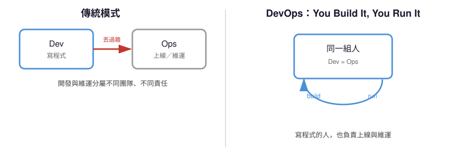
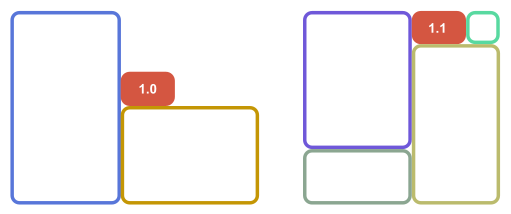
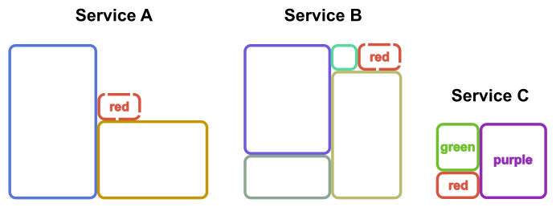
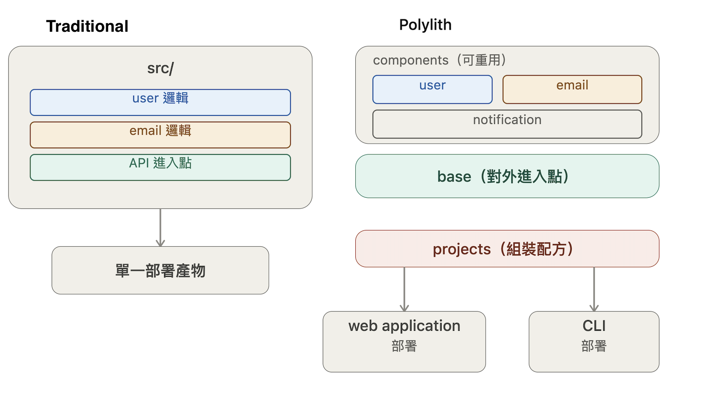
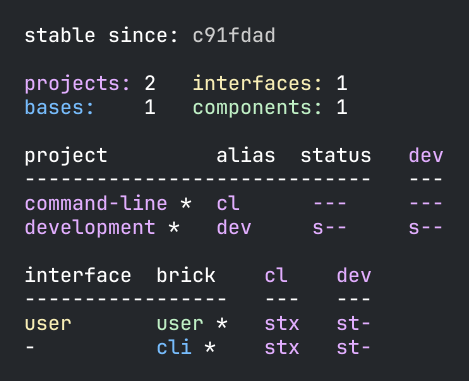

<!-- _class: lead -->

# Polylith：帶有函數式編程思考的軟體架構

---

# Laurence Chen / 陳家宏

- IT 顧問、政大兼任助理教授
- Clojure, dbt-Taipei 線下活動主辦人
- 從試算表到資料平台－重構資料工程的技術與團隊


---

# Table of Contents

- 現代軟體開發方法論的架構挑戰
- Polylith 是什麼？
- Polylith 與 Functional Programming 的關係


---

# 01 / 問題意識

---

# DevOps 的前提：You Build It, You Run It

- DevOps 讓「開發」與「維運」合一：寫程式的人也要負責上線與維運
- 於是「同一組人只能負責一個部署單元」變成合理的分工方式
- 這個前提，讓 monolith（單一部署單元）天然對應單一團隊——但系統一大，耦合的痛點就出現了



---

# Monolith 的痛點

- 部署耦合：小改動也要走一次整個系統部署
- 測試也一樣：想驗證一小段邏輯，卻要跑起整個系統
- 那如果 1 個 Monolith 必須開始由 2 個以上的團隊來管理呢？

---

# Microservices 的痛點

當兩個 service 需要同一段業務邏輯時，只剩三個選擇：

1. **複製貼上** → 相似程式碼重複，難以維護
2. **抽出共用 library** → library 版本管理、發版協調成本
3. **抽出成獨立 service** → 多一次網路呼叫拉高延遲，也多一套要維運監控的服務

|  |  |
|:---:|:---:|
| 抽出共用 library | 抽出成獨立 service |

---

# 第三條路

> 如果有一種架構，讓「程式碼邊界」與「部署邊界」脫鉤呢？

程式碼可以共用，但部署方式仍然可以自由組合。

---

# 02 / 什麼是 Polylith？

- 開發時：比較像 Monolith
- 部署時：比較像 Microservices

---

# 四個核心積木

| 名稱 | 角色 |
|---|---|
| **Workspace** | 整個 repo 的根目錄，所有積木都放在同一處 |
| **Component** | 高階邏輯單元，通常是**業務邏輯**： `invoice`, `user`, `order`；**基礎建設邏輯**：`authentication, database, log`，或**第三方整合邏輯**：`crm-api, payment-api, sms-api` |
| **Base** | 提供 **API**（CLI / REST / GraphQL…），委派給 components |
| **Project** | 挑一組 base + components + libraries，組成「**可部署單元**」 |

---

# Workspace

- 整個 repo 的根目錄，所有 component、base、project 都放在同一處，用同一份版本控制管理
- `development` 目錄提供全系統的開發環境，這就是「開發時像 Monolith」的具體依據

```
▾ workspace
  ▸ bases
  ▸ components
  ▸ development
  ▸ projects
```

---

# Component

- 測試時可替換實作（換成 mock/stub），呼叫端完全不用改
- 同一批 components，可以被不同 project 反覆組合

```
▾ workspace
  ▾ components
    ▾ mycomponent
      ▸ src
      ▸ test
      ▸ resources
```

---

# Base

- 只做「委派」給 components，不放業務邏輯，保持輕薄、可替換
- 同一批 components，可以套上不同的 Base（REST / CLI / GraphQL…）對外曝露成不同型態

```
▾ workspace
  ▾ bases
    ▾ mybase
      ▸ src
      ▸ test
      ▸ resources
```

---

# Project

- Project = 選一組 base + components + libraries，組成一個「可部署單元」
- 同一個 component／base，可以被多個 project 重複引用組合
  （例如同一個 payment component，可以同時被 REST API project 與 CLI project 引用）
- Project 本身不放邏輯，只有 build script 與 dependency 宣告——邏輯永遠留在 component/base

```
▾ workspace
  ▾ projects
    ▾ myproject
      deps.edn
```

---

# Traditional vs Polylith



---

# poly CLI：偵測 commit 掌握「改變」

- `poly info` → 顯示 (狀態) 哪些 component, base 變更，哪些測試會被觸發
- `poly test` → 只跑受影響的 component, base, projects
- `poly check` → 驗證 workspace 結構完整性
- `poly create` / `poly deps` → scaffold 新的 component, base、視覺化相依關係圖



---

# 何時該考慮引入 Polylith？

- 同一段「業務邏輯」已經在兩個以上的部署單元被複製，或已經抽成共用 library。
- 部署形態本身會變動或分歧：同一批邏輯，人類走 web application／REST，AI agent 走 CLI 或 MCP

---

# Polylith 的語言支援

- 起源於 Clojure 社群
- 目前在 Clojure, Python, Java 都有 poly CLI 的 support 
- 本身是架構概念，不受限於程式語言。

---

# 範例 Repo

- Python：[github.com/DavidVujic/python-polylith-example](https://github.com/DavidVujic/python-polylith-example)
- Clojure：[github.com/DavidVujic/polylith-experiments](https://github.com/DavidVujic/polylith-experiments)

---

<!-- _class: lead -->

# 03 / Polylith 與 Functional Programming

---

# FP：只講 What，不講 How

- Function 的呼叫端只在乎「輸入輸出」（what）
- 不需要知道函式內部怎麼實作（how）
- 這種解耦，是 FP 靈活性的來源

---

# Polylith：解耦部署的 What 與 How

- Component 定義了 **what**（業務邏輯做什麼）
- Project 的組合方式決定了 **how**（用什麼型態部署）
- 換句話說：**Polylith 把「部署」這件事本身函式化了**——同一組 what，可以套用不同的 how

---

# Q&A 

|  |  |
|:---:|:---:|
| LinkedIn | Substack |
