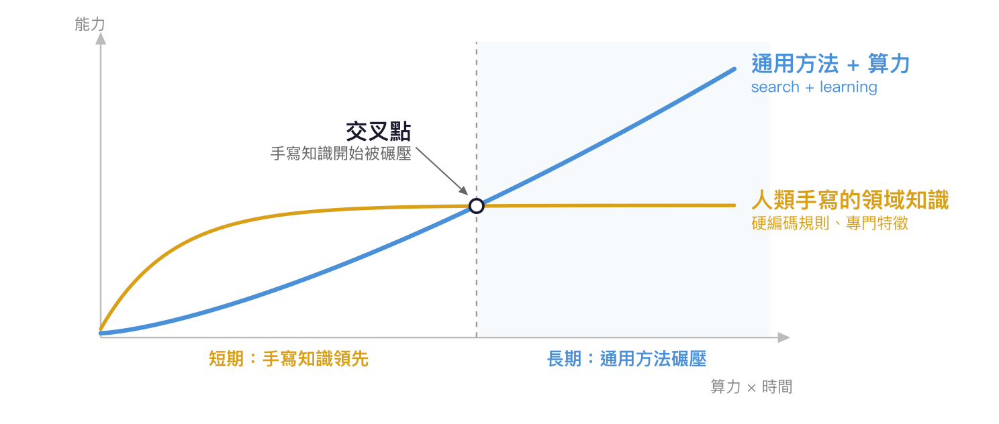
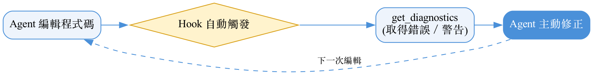
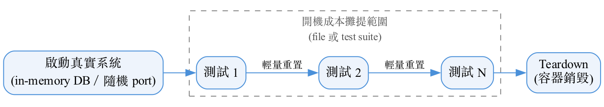
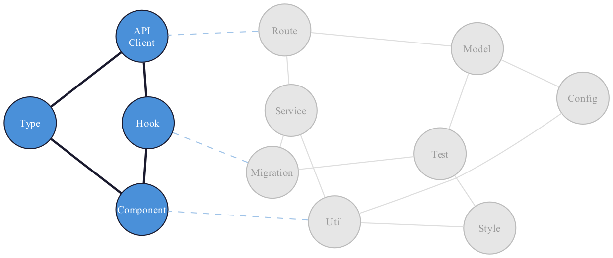

<!-- _class: lead -->

# 後 Coding Agent 時代的軟體工程：TDD、EDD 與 Context Efficiency

---

# Laurence Chen / 陳家宏

- IT 顧問、作家、政大兼任助理教授
- Clojure, dbt-Taipei 線下活動主辦人
- 從試算表到資料平台－重構資料工程的技術與團隊

---

# Table of Contents

- 新人的問題
- The Bitter Lesson
- AI 時代的軟體工程
- 4 Levels

---

# 新人的問題

> 「現在都叫 AI Agent 寫程式了，那還需要學習什麼？」
> 「怎樣子的進步在後 Coding Agent 時代還算是進步呢？會不會現在學了半天的東西，轉眼間又內建於 AI ？」

- Coding Agent 已經成為許多工程師的日常工具
- 但「工程」、「進步」的定義似乎變得模糊了

---

# 回顧一下歷史

- 組語時代
- C/C++ 語言時代 => 效能優先
- Garbage Collection 時代 => Developer 優先
- Coding Agent 時代 => Agent 優先

---

# The Bitter Lesson（Rich Sutton, 2019）

> 所有試圖把**人類手寫的領域知識**塞進 AI 的方法，長遠來看都會被「**通用搜尋 + 巨量算力**」碾壓。

- 西洋棋、圍棋、語音辨識、電腦視覺——同一齣戲演了四次
- 能**無限**吃算力的只有兩件事：**search** 與 **learning**

---

# 那，我今天講的會不會都被碾壓？

- Sutton 講的是：不要把知識 **build 進 AI 系統裡**
- 我今天講的是：把**環境**準備好給 AI
  - 算力越強，好的 verifier 與便宜的環境**越值錢**，不是越沒用

> **你是在「塞答案」給 agent，還是在「降低 agent 搜答案的成本」？**

- 前者會被內建掉（高折舊），後者隨算力增值（低折舊）
- 接下來每個 Level，我都會標上它的**折舊率**

---

# AI 時代的軟體工程

- 安裝 tools 給 Coding Agent
- 準備 integration test harness
- skills
- 節省 token, context window size

以下用 4 個 Level 逐一拆解

---

# Level 1：IDE for agent 

- 人類工程師仰賴 IDE 的定義查詢、型別提示、即時錯誤訊息
  - Agent 同樣需要這些結構化訊號
- 解法：把「IDE 等級」的理解能力交給 agent，**安裝** lsp 相關工具
  - `find_definition`, `find_references`
  - `rename_symbol` ;; 跨檔案安全重新命名
  - `get_diagnostics` ;; 取得該檔案的錯誤、警告、hint

> 折舊率 **低**：compiler／type checker 是 ground truth verifier，不是人類啟發式

---

# Agent hook

- 工具裝了，還不等於**正確地用了**
  - 解法：用 **hook** 讓 agent 每次編輯後自動跑 `get_diagnostics`
  - 把 shift errors left 從「被動可用」變成「主動觸發」

> 折舊率 **中**：hook 是硬編碼的控制策略，夠強的 agent 會自己決定何時驗證

---

# Level 2：Integration Test-Driven Development

- 裝了 **superpowers**（一套內建 TDD 流程的 agent skill 套件）的話，預設會跑 TDD 。
- 挑戰
  - TDD 的 test 是哪一種？
  - Unit test 只驗證單一函式的正確性
  - Integration test 能讓 agent 更早發現跨模組、跨系統的行為問題
- 解法：準備 **integration test harness** 給 Agent

> 折舊率 **最低**：便宜、可重複的驗證環境，正是 search 的燃料

---

# integration test harness

- 設計參考原則：
  - 啟動**真實系統**、走真實協定，不 mock —— 用輕量/ephemeral 環境（in-memory DB、隨機 port、容器 teardown）換取速度
  - 開機成本以**可調範圍**（file 或 test suite）攤提一次——範圍越大越省，隔離風險越高；測試間用**輕量重置**（truncate / transaction rollback）取代整套重開
  - Harness 封裝成**可重用元件**，不是寫死在單一專案裡的樣板。
  - 需要前置狀態（如登入狀態）時直接構造合法憑證 (cookie)，跳過完整流程。

---

# Level 3：EDD（Eval-Driven Development）

- 傳統測試驗證「功能對不對」
- EDD 驗證「**agent 的行為**對不對、skill 管不管用」
- 解法：
   - 寫 skills 調整 agent 的 **capability** 或 **preference**
   - 開發 skills ，記得要加上 **Eval**。

> 折舊率：skill **高**（會被內建掉）／ eval **低**（測量不會過時）

---

# 案例：cljfmt 引發的 behavioral gap

- cljfmt 調整縮排後，agent 的 `str_replace` 因空白字元不符而反覆失敗。=> 整個檔案重寫，浪費 token 。
- **解法**：寫一個 skill，讓 agent 改用 S-expression 結構比對取代文字比對
- **後來呢？** 有些 agent 已經內建 **hash edit**，這個 skill 被碾壓了
  - 這是 bitter lesson 發生在我身上的一手證據：skill 是**短期套利**，要預期它被吃掉

---

# 案例：Graphviz DOT language

- 痛點：寫 skills 時，workflow／decision tree 用**自然語言**描述，寫起來模糊，寫完也很難驗證有沒有寫錯
- 解法：改用 **Graphviz DOT**——一種 declarative 的有向圖語言
  - 純文字格式，LLM 讀得懂；又是 formal language，歧義大幅減少
  - LLM 讀取時是在「**執行規格**」，而非「理解意圖」——更可靠
  - 同一份原始碼可直接渲染成圖，人類也方便 review

---

# 案例：Graphviz DOT language — code example

---

# 案例：Graphviz DOT language — 渲染結果

---

# Level 4：Context Efficiency

- 完成一個任務，agent 不需要讀整個 codebase
- 只需要讀「任務相關的那幾個檔案」——**局部子圖**（task-relevant subgraph）
- 子圖的大小決定了 context size 。
- 但子圖大小是由**軟體架構**決定，不是由模型決定

> 折舊率 **低**：架構決定的是「要正確所需的資訊量」，那不是模型的缺陷

---

# 案例：Agent-Ready Stack

- **TypeScript + React + Supabase**：單一功能橫跨 **component/hook/state/API**
  
  **client/type**，子圖拆散到多檔案、越滾越大
- **Clojure Stack Lite** 用三個選擇縮小子圖：
  - **HTMX**：狀態由 server response 驅動，消除隱含 client state
  - **HoneySQL**：查詢即 SQL-as-data (not ORM)，消除隱含 lazy loading
  - **同步 IO**：例外沿單一路徑傳播，消除隱含錯誤路徑

- **原則**：顯式優於隱含，對 agent 是結構性保證，而非語言美德

---

# 小結：用折舊率回答一開始的問題

| Level | 投資 | 折舊率 |
|---|---|---|
| L1 | LSP 工具（ground truth 訊號） | 低 |
| L1 | hook（硬編碼控制策略） | 中 |
| L2 | integration test harness | **最低** |
| L3 | skill（塞知識給 agent） | **高** |
| L3 | eval（測量 agent 行為） | 低 |
| L4 | 軟體架構：顯式優於隱含 | 低 |

> 什麼樣的進步還算是進步？**投資折舊率低的東西——降低搜尋成本的，不是塞答案的。**

---

# Reference

- The Bitter Lesson, Rich Sutton (2019)
  http://www.incompleteideas.net/IncIdeas/BitterLesson.html
- 輕量級工作流程——從 Graphviz DOT language 到 LangGraph
  https://replware.substack.com/p/1bf
- Agent-Ready Stack
  https://humorless.github.io/posts-output/agent-ready-stack
- clj-debug skill（debugging workflow 範例出處）
  https://github.com/humorless/clj-native-agent/blob/main/skills/clj-debug/SKILL.md

---

# Q&A

|  |  |
|:---:|:---:|
| LinkedIn | Substack |
