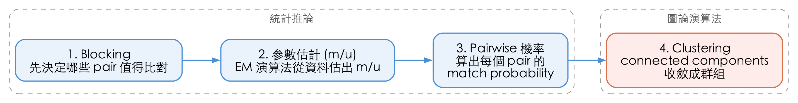
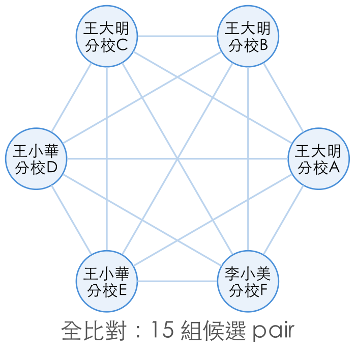
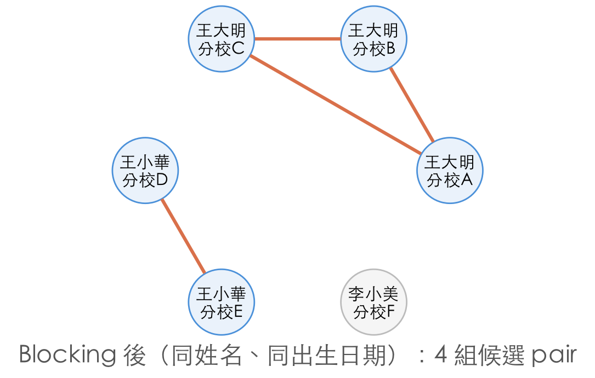
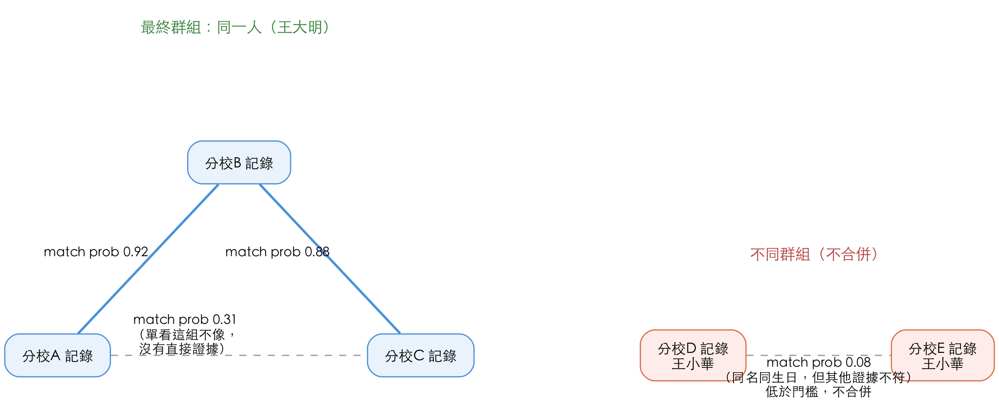

<!-- _class: lead -->

# 你的資料庫裡有幾個王大明？從補習班學生資料談 Entity Resolution

---

# Laurence Chen / 陳家宏

- IT 顧問、作家、政大兼任助理教授
- Clojure, dbt-Taipei 線下活動主辦人
- 從試算表到資料平台－重構資料工程的技術與團隊

---

# Table of Contents

- 問題緣起：一個補習班的真實案例
- 什麼是 Entity Resolution？
- 為什麼規則不夠用：機率模型的直覺
- Splink 介紹：從 blocking 到 match probability
- 自我診斷：你的組織有這個問題嗎？

---

<!-- _class: lead -->

# 問題緣起：一個補習班的真實案例

---

# 姓名＋生日，夠識別一個人嗎？

- 2021 年在一家補習班設法導入 MDS（Modern Data Stack）的實際經驗
   - 「學生資料表」不知為何，並沒有 uuid 的 primary key
   - 同名同姓、又同年月日生的學生，遠比預期多。
- 原因：
   - 同名同姓多：取名參考算命，菜市場名效應明顯
   - 同一學生變多筆記錄：全台 2 萬學生，搬家後常在不同分校重新註冊，沒有跨分校的唯一識別碼

---

# 資料實體問題

這不只是補習班的問題——同樣的「同一實體、多筆記錄」在各行各業反覆出現：

- 商家在不同的廣告平台取得的廣告受眾資料 (同一人在不同平台)
- 兩家企業合併，要整併客戶資料時，沒有一致的實體。（同一客戶在不同廠）
- 行銷活動重複寄送，或漏發給同一人的另一個帳號
- 問題不在資料量，而在**解析實體的能力**

---

<!-- _class: lead -->

# 什麼是 Entity Resolution？

---

# Entity Resolution 的核心概念

- **定義**：判斷不同來源、不同格式的記錄，是否指向現實世界中同一個實體（人、公司、地址……）
- 它是**資料品質問題**，不是 ETL 問題
- 它不等於 deduplication
  - Deduplication 通常處理單一來源內的重複列
  - Entity Resolution 涵蓋跨系統、跨來源、甚至跨時間的實體解析

---

# 為什麼這是 AI 時代資料治理的地基

- RAG、訓練資料的品質，取決於底層實體是否被正確合併或區分
- 錯誤的實體解析 → 錯誤的分析結論、錯誤的模型輸入
- Entity Resolution （實體解析）做不好，上層所有資料應用都建立在流沙上

---

<!-- _class: lead -->

# 為什麼規則不夠用

---

# 規則式比對的極限

- 常見規則：姓名 AND 生日 AND 地址相同 → 判定同一人
- 現實中的雜訊：
  - 同名同姓本來就存在
  - 地址有時候會變更
  - 輸入錯誤、欄位缺漏、格式不一致
- 規則只能給「是」或「否」，無法權衡**證據強度**
- 規則寫得太嚴 → 漏配 (Under-matching) ；寫得太鬆 → 過度匹配 (Over-matching)

---

# Fellegi-Sunter 的機率模型

- 每個比對欄位（姓名、生日、電話、地址……）都有各自的
  - **m 值**：兩筆 record 為同一人時，此欄位相符的機率
  - **u 值**：兩筆 record 為不同人時，此欄位恰好相符的機率
- 綜合多個欄位的證據，每兩筆 record 計算一個 **Match Probability**，而非非黑即白的 if-else

  $$
  \text{match weight} = \log_2\left(\frac{m}{u}\right) = \log_2\left(\frac{P(\text{相符} \mid \text{同一實體})}{P(\text{相符} \mid \text{不同實體})}\right)
  $$

  $$
  \text{match probability} = \frac{1}{1 + 2^{-\text{match weight}}}
  $$

- 能處理部分符合、欄位缺漏、以及不同欄位鑑別力不同的情況

  - 例如：身分證號相符的證據力，遠大於姓氏相符

---

<!-- _class: lead -->

# Splink 實作導覽

---
# Splink 的基本流程

1. **Blocking** — 先決定哪些 pair 值得比對，避免全比對組合爆炸
2. **參數估計（m/u）** — 用 EM（Expectation-Maximization）演算法從資料中估出 m/u
3. **Pairwise 機率** — 用 m/u 算出每個 pair 的 match probability
4. **Clustering** — 用 connected components 把配對結果收斂成群組

---

# Blocking：先縮小候選集合

以開場案例的 6 筆學生記錄為例：

|  |  |
|:---:|:---:|

- 全比對是 O(n²)：6 筆已是 15 組候選；全台 2 萬筆學生就是近 2 億組
- Blocking rule（同姓名、同出生日期）把候選集合收斂到只剩「同名同生日」的組合——裡面有真的重複註冊，也有巧合的同名同生日

---

# Match Probability 決定最終分群

延續上頁的候選組，Splink 再用電話、地址等其他證據算出每組的 match probability：

- A-B、B-C 都高，但 A-C 只有 0.31——靠 B 當橋樑才被 connected components 收進同一群組
- 分校 D/E 雖同名同生日，match probability 只有 0.08 → 判定為不同人

---

# 用 Splink 落地：關鍵決策點

- **Blocking 策略設計**
  - 先縮小比對候選集合（例如：同姓名、同出生日期），避免 O(n²) 全比對
  - Blocking rule 太窄 → 漏掉真配對；太寬 → 候選組合爆炸性成長
- **模型訓練**
  - 用 EM（Expectation-Maximization）演算法多次迭代估算各欄位的 m/u 機率
- **Match Probability 解讀**
  - 設定 threshold：高於某分數自動合併、灰色地帶交由人工複核

---

<!-- _class: lead -->

# 自我診斷框架

---

# 你的組織有 ER 問題嗎？

常見症狀：

- 客服、業務常反映「系統裡有兩個一樣的人」
- 行銷活動重複發送，或漏發給同一人的不同帳號
- 報表數字對不起來（人數統計、業績歸因）
- 多個系統各自建檔，缺乏跨系統的唯一識別碼

---

# 何時該考慮用 Splink？

| 情境 | 建議做法 |
|---|---|
| 有唯一鍵 | 別用 Splink，直接 join |
| 沒有唯一鍵，但量小到能人工逐筆核對（約幾十～三百筆、不常做） | 人工核對 |
| 沒有唯一鍵，資料髒但量不大、誤判代價低、一次性任務 | 寫簡單規則（SQL + fuzzy function）就好，不必上 Splink |
| 沒有唯一鍵，量大、髒、誤判代價高、或會反覆執行 | **這才是 Splink 真正該登場的情境** |

---

# 延伸閱讀

- Fellegi, I. P., & Sunter, A. B. (1969). *A Theory for Record Linkage*. Journal of the American Statistical Association.

---

# Q&A

- 你的資料庫裡，還藏著幾個王大明？

|  |  |
|:---:|:---:|
| LinkedIn | Substack |
